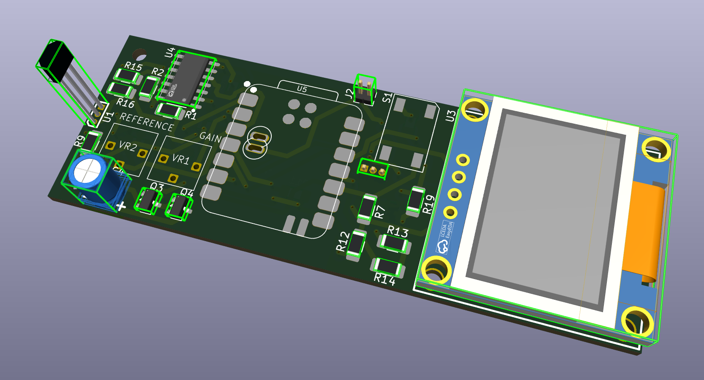
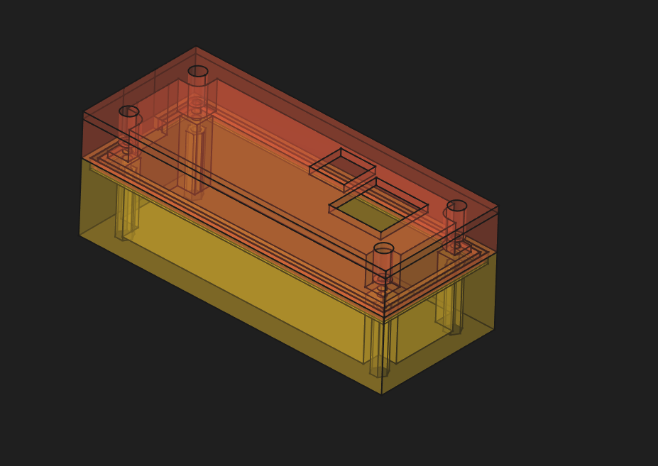
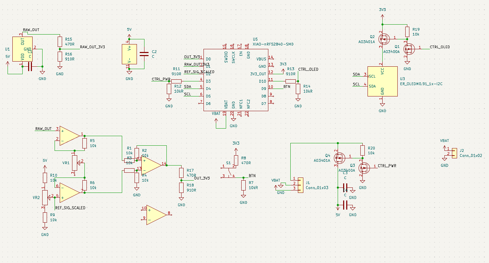
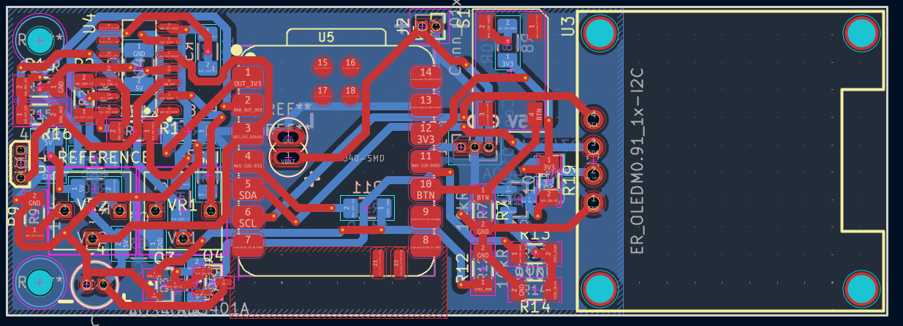

# Handheld Hall Effect Current Sensor

This is a handheld hall effect current sensor, a device used to measure current without needing to directly touch the circuit being measured.

# Features
* Completely contained on one handheld case, including battery
* Self powered!
* OLED screen for easy measurement
* Two adjustable calibration resistors for easy calibration

# Assembly
The handheld hall effect current sensor is easily assembled with just 4 parts:
* The bottom part of case
* The battery, which sits in the bottom part of case
* The PCB, which goes between the top and bottom part of the case
* The top part of the case

It is held together with 4 M2 screws and 4 M2 nuts.

# Technical stuff

The hall effect voltage output is fed into an insturmentation amplifier to subtract it from the known zero current voltage and amplify the result. Both the gain and the reference voltage can be easily adjusted with two variable resistors on the PCB. The output of the insturmentation amplifier goes into a Seeed Studio nrf52840 microcontroller's ADC where it is processed. The current reading is then written onto the OLED.

The whole system is powered from a lipo battery, which is regulated to 3.3v by the Seeed Studio microcontroller. An additional [3.3v to 5v off-board converter](https://www.amazon.com/Comidox-Module-Voltage-Converter-0-9-5V/dp/B07L76KLRY/) is used to power the op amp and hall effect sensor.

# IMAGES
Full schematic:

PCB layout:
